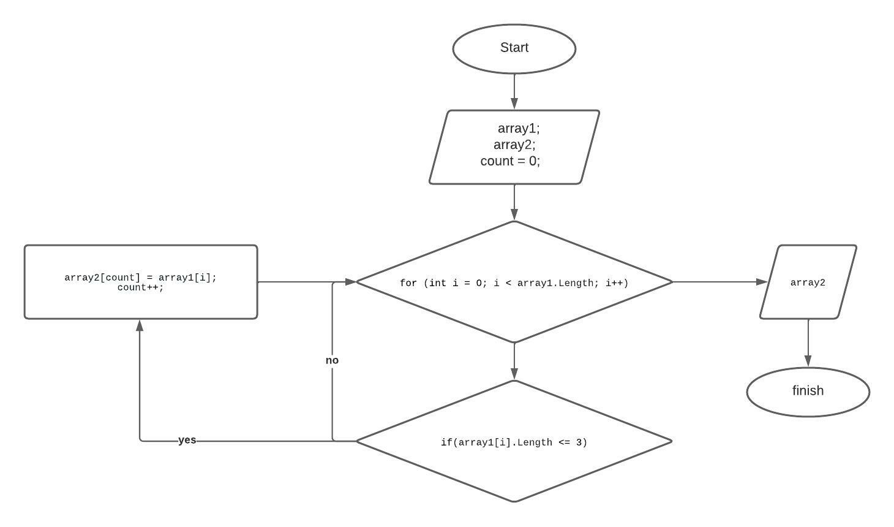

# finalTestWork

## Task

Написать программу, которая из имеющегося массива строк формирует новый массив из строк,
длина которых меньше, либо равна 3 символам. Первоначальный массив можно ввести с клавиатуры,
либо задать на старте выполнения алгоритма. При решении не рекомендуется пользоваться коллекциями,
лучше обойтись исключительно массивами.
Example:

["Hello", "2", "world", ":-)"] → ["2", ":-)"]
["1234", "1567", "-2", "computer science"] → ["-2"]
["Russia", "Denmark", "Kazan"] → []

## Algorithm of actions:

1. Объявляем 2 массива одинаковой длинны.
2. Объявляем функцию, где цикл с длинной массива. Внутри цикла проверка на условие меньше, или равно 3. Если значение в строке ячейки первого массива меньше, или равно 3 символам, то переносим во второй массив. count используем, чтобы перенос элементов был по очередности, без лишних пробелов при выводе.
4. После присвоения переменная count увеличивается на 1 и возвращается к циклу, где i увеличивается на 1. 
5. Таким образом, мы пробегаем по массиву до конца.

Вот и сама блок-схема!
